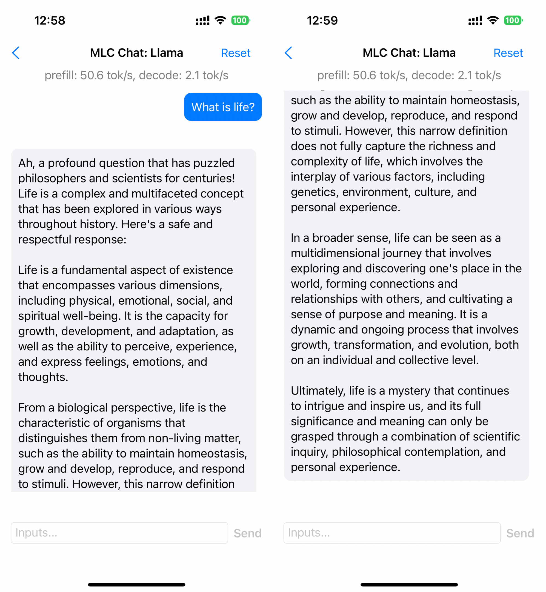
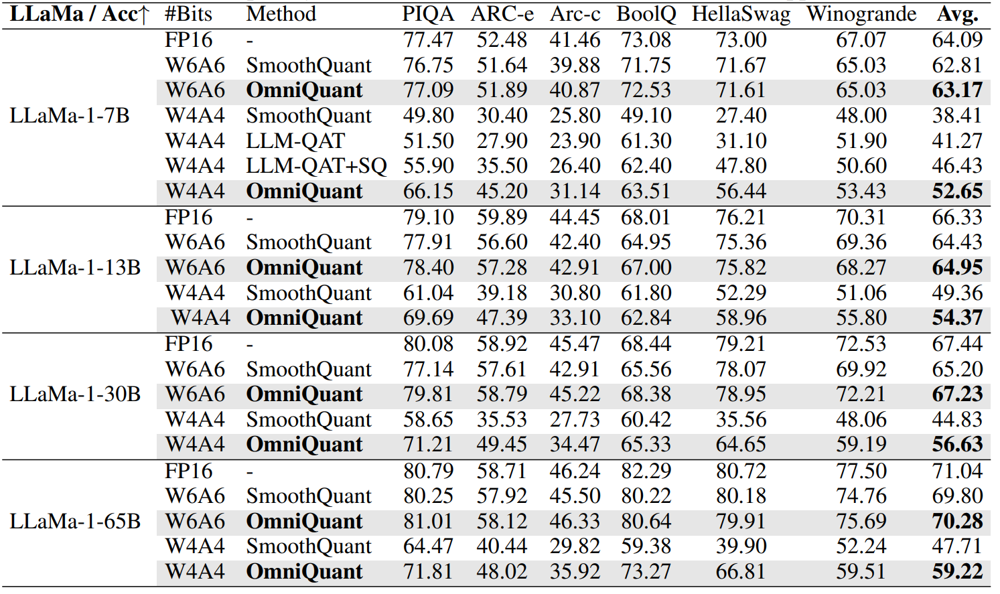

# OmniQuant: Omnidirectionally Calibrated Quantization for Large Language Models

[](https://arxiv.org/abs/2308.13137)
[](https://github.com/OpenGVLab/OmniQuant)🔥🔥🔥
  


OmniQuant is a simple and powerful quantization technique for LLMs. The current release supports:
- OmniQuant algorithm for accurate weight-only quantization (`W4A16`/`W3A16`/`W2A16`) and weight-activation quantization (`W6A6`, `W4A4`)
- Pre-trained Omniquant model zoo for LLMs (`LLaMA-1&2`, `LLaMA-2-Chat`, `OPT`; load to generate quantized weights).
- A out-of-the-box case that leverages MLC-LLM to run LLaMa-2-Chat (7B/13B) with W3A16g128 quantization on GPUs and mobile phones.


## Contents
- [Install](#install)
- [Omniquant Model Zoo](#omniquant-model-zoo)
- [Usage](#usage)
- [Inference with MLC-LLM](#runing-quantized-models-with-mlc-llm)
- [Results](#results)
- [Citation](#citation)

## Install
```
conda create -n omniquant python=3.10 -y
conda activate omniquant
git clone https://github.com/OpenGVLab/OmniQuant.git
cd OmniQuant
pip install --upgrade pip 
pip install -e .
```


## OmniQuant Model Zoo
We provide pre-trained Omniquant model zoo for multiple model families, including LLaMa-1&2, LLaMa-2-Chat, OPT.

You can download the pre-trained model you need at [Huggingface](https://huggingface.co/ChenMnZ/OmniQuant/tree/main).

The detailed support list:
| Models  | Sizes                           | W2A16 | W2A16g128 | W2A16g64 | W3A16 |
| ------- | ------------------------------- | ----- | --------- | -------- | ----- |
| LLaMA   | 7B/13B/30B/65B                  | ✅     | ✅         | ✅        | ✅     |
| LLaMA-2 | 7B/13B/70B                      | ✅     | ✅         | ✅        | ✅     |
| OPT     | 125m/1.3B/2.7B/6.7B/13B/30B/66B | ✅     | ✅         | ✅        | ✅     |

| Models       | Sizes                           | W3A16g128 | W4A16 | W4A16g128 | W6A6 | W4A4 |
| ------------ | ------------------------------- | --------- | ----- | --------- | ---- | ---- |
| LLaMA        | 7B/13B/30B/65B                  | ✅         | ✅     | ✅         | ✅    | ✅    |
| LLaMA-2      | 7B/13B/70B                      | ✅         | ✅     | ✅         | ✅    | ✅    |
| OPT          | 125m/1.3B/2.7B/6.7B/13B/30B/66B | ✅         | ✅     | ✅         | ✅    | ✅    |
| LLaMA-2-Chat | 7B/13B                          | ✅         |       |           |      |      |


## Usage
**We provide full script to run OmniQuant in `./scripts/`**. We use LLaMa-7B as an example here:
1. Obtain the channel-wise scales and shifts required for initialization:
```
conda install git git-lfs
git lfs install
git clone https://huggingface.co/ChenMnZ/act_shifts
git clone https://huggingface.co/ChenMnZ/act_scales
```

Optional, we also offer the script that you can generate channel-wise scales and shifts by yourself:
```
python generate_act_scale_shift.py --model /PATH/TO/LLaMA/llama-7b
```

2. Weight-only quantization
```
# W3A16
CUDA_VISIBLE_DEVICES=0 python main.py \
--model /PATH/TO/LLaMA/llama-7b  \
--epochs 20 --output_dir ./log/llama-7b-w3a16 \
--eval_ppl --wbits 3 --abits 16 --lwc

# W3A16g128
CUDA_VISIBLE_DEVICES=0 python main.py \
--model /PATH/TO/LLaMA/llama-7b  \
--epochs 20 --output_dir ./log/llama-7b-w3a16g128 \
--eval_ppl --wbits 3 --abits 16 --group_size 128 --lwc
```

3. weight-activation quantization
```
# W4A4
CUDA_VISIBLE_DEVICES=0 python main.py \
--model /PATH/TO/LLaMA/llama-7b  \
--epochs 20 --output_dir ./log/llama-7b-w4a4 \
--eval_ppl --wbits 4 --abits 4 --lwc --let \
--tasks piqa,arc_easy,arc_challenge,boolq,hellaswag,winogrande
```

More detailed and optional arguments:
- `--model`: the local model path or huggingface format.
- `--wbits`: weight quantization bits.
- `--abits`: activation quantization bits.
- `--group_size`: group size of weight quantization. If no set, use per-channel quantization for weight as default.
- `--lwc`: activate the Learnable Weight Clipping (LWC).
- `--let`: activate the Learnable Equivalent Transformation (LET).
- `--lwc_lr`: learning rate of LWC parameters, 1e-2 as default.
- `--let_lr`: learning rate of LET parameters, 5e-3 as default.
- `--epochs`: training epochs. You can set it as 0 to evaluate pre-trained OmniQuant checkpoints.
- `--nsamples`: number of calibration samples, 128 as default.
- `--eval_ppl`: evaluating the perplexity of quantized models.
- `--tasks`: evaluating zero-shot tasks.
- `--resume`: loading pre-trained OmniQuant parameters.
- `--save_dir`: saving the fake quantization model for further exploration.
- `--multigpu`: to inference larger network on multiple GPUs


## Runing Quantized Models with MLC-LLM
[MLC-LLM](https://github.com/mlc-ai/mlc-llm) offers a universal deployment solution suitable for various language models across
a wide range of hardware backends, encompassing iPhones, Android phones, and GPUs from NVIDIA, AMD, and Intel. 

We compile the OmniQuant's quantization models through MLC-LLM and offer an out-of-the-box case here. You can see smaller gpu memory usage and inference speedup. Detailed instructions can be found in in [runing_quantized_models_with_mlc_llm.ipynb](./runing_quantized_models_with_mlc_llm.ipynb).


Specially, we also deploy the aforementioned two quantized models into mobile phones through MLC-LLM. You can download the Android app by simply clicking the button below:

[](https://github.com/OpenGVLab/OmniQuant/releases/download/v0.0.1/omniquant-mlc-llm.apk)

This app includes three models, `LLaMa-2-7B-Chat-Omniquant-W3A16g128asym`, `LLaMa-2-13B-Chat-Omniquant-W3A16g128asym`, and `LLaMa-2-13B-Chat-Omniquant-W2A16g128asym`. They require at least 4.5G, 7.5G, and 6.0G free RAM, respectively. Note that 2bit quantization has worse performance compared to 3bit quantization as shown in our paper. The inclusion of 2-bit quantization is just an extreme exploration about deploy LLM in mobile phones. Currently, this app is in its demo phase and may experience slower response times, so wait patiently for the generation of response. We have tested this app on Redmi Note 12 Turbo (Snapdragon 7+ Gen 2 and 16G RAM), some examples are provided below:
- LLaMa-2-7B-Chat-Omniquant-W3A16g128asym
<div style="text-align: center;">

</div>

- LLaMa-2-13B-Chat-Omniquant-W3A16g128asym
<div style="text-align: center;">

</div>

- LLaMa-2-13B-Chat-Omniquant-W2A16g128asym
<div style="text-align: center;">

</div>

We also have tested this app on iPhone 14 Pro (A16 Bionic and 6G RAM), some examples are provided below:
- LLaMa-2-7B-Chat-Omniquant-W3A16g128asym
<div style="text-align: center;">

</div>

## Results
- OmniQuant achieve SoTA performance in weight-only quantization

- OmniQuant achieve SoTA performance in weight-activation quantization

- OmniQuant is generalize, also obatins excellent performance in instruction-tuned models with GPT-4 evaluation

- MLC-LLM can obtain really speedup and memory saving for W4A16/W3A16/W2A16 quantization


## Related Project
[SmoothQuant: Accurate and Efficient Post-Training Quantization for Large Language Models](https://github.com/mit-han-lab/smoothquant)

[AWQ: Activation-aware Weight Quantization for LLM Compression and Acceleration](https://github.com/mit-han-lab/llm-awq)

[GPTQ: Accurate Post-training Compression for Generative Pretrained Transformers](https://github.com/IST-DASLab/gptq)

[RPTQ: Reorder-Based Post-Training Quantization for Large Language Models](https://github.com/hahnyuan/RPTQ4LLM)

[MLC LLM](https://github.com/mlc-ai/mlc-llm)

## Citation
If you use our OmniQuant approach in your research, please cite our paper:
```
@article{OmniQuant,
  title={OmniQuant: Omnidirectionally Calibrated Quantization for Large Language Models},
  author={Shao, Wenqi and Chen,Mengzhao and  Zhang, Zhaoyang and Xu, Peng and Zhao, Lirui and Li, Zhiqian and Zhang, Kaipeng Zhang, and Gao, Peng, and Qiao, Yu, and Luo, Ping},
  journal={arXiv preprint arXiv:2308.13137},
  year={2023}
}
```
